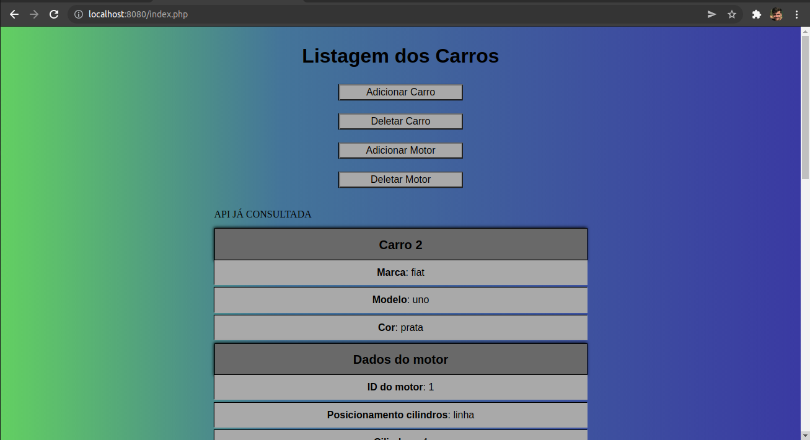
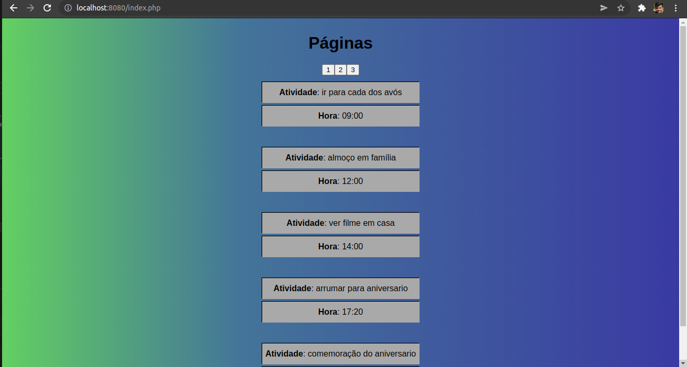

<!-- #### Tarefa 1 e 2

-  ```cd tarefa1``` para carregar o css da page 1
-  ```cd tarefa2``` para carregar o css da page 2

- Para as tarefas 1 e 2, rodei no servidor local com: ```php -S localhost:8080```

- A conexão do banco de dados para a tarefa 1 também foi local, com MySql:  ```cd tarefa1/db```
- Os scripts de criação local são: ```php createDB.php``` e ```php createTable.php```

- Para a tarefa 2 o mesmo:  ```cd tarefa2/db```
- Os scripts de criação local são: ```php createDB.php``` e ```php createTable.php```
-->

<p align="center">
  
  
</p>
